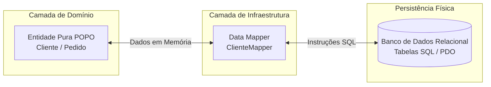

# O Padrão Data Mapper (Mapeador de Dados)

> 📚 **Navegação do Guia de Padrões de Persistência**:
> **[Visão Geral (Persistence)](Persistence.md)** | **[Data Mapper](Data-Mapper.md)** | **[Identity Map](Identity-Map.md)** | **[Unit of Work](Unit-of-Work.md)** | **[Virtual Proxy](Virtual-Proxy.md)**

---

## 🏛️ O que é o Data Mapper?

O **Data Mapper** (Mapeador de Dados) é um padrão de projeto arquitetural catalogado por **Martin Fowler** em seu livro *Patterns of Enterprise Application Architecture (PoEAA)*.

Sua definição clássica é:
> *"Uma camada de mapeadores que transfere dados entre objetos e um banco de dados, mantendo-os independentes um do outro e do próprio mapeador."*

No ecossistema PHP moderno e em exames de arquitetura (como Zend Certified PHP Engineer e discussões da PHP-FIG), o Data Mapper é a pedra fundamental do **Doctrine ORM**, em forte contraste com o padrão **Active Record** utilizado pelo Eloquent (Laravel).

---

## 🎯 O Problema da Impedância Objeto-Relacional

Bancos de dados relacionais e linguagens orientadas a objetos operam em paradigmas fundamentalmente distintos:

* **Tabelas Relacionais**: São baseadas na álgebra relacional. Lidam com linhas, colunas, chaves primárias/estrangeiras e dados escalares simples.
* **Modelos de Domínio**: São orientados a objetos. Lidam com identidade, grafos de relacionamentos complexos (muitos-para-muitos, bidirecionais), encapsulamento, herança, polimorfismo e tipos ricos (Value Objects, Enums).

Quando misturamos as regras de persistência dentro das classes de negócio (como no Active Record), criamos um **alto acoplamento**:
1. O domínio fica dependente de um driver de banco específico.
2. Modificar uma coluna na tabela exige alterar a regra de negócio.
3. Fica impossível testar uma entidade sem subir um banco de dados de testes.

### A Solução: Separação de Responsabilidades (POPO)
Com o Data Mapper, as entidades tornam-se **POPOs (Plain Old PHP Objects)**. Elas não herdam de nenhuma classe base de framework (`class User extends Model` ❌), não conhecem conexões PDO e contêm unicamente lógica de negócio pura.



---

## 💻 Implementação Prática em PHP 8.2+ Puro

Abaixo está uma implementação limpa, fortemente tipada e alinhada com as melhores práticas de PHP moderno e PSRs.

### 1. A Entidade de Domínio Pura (Sem acoplamento com banco)

Observe que a classe `Cliente` não possui nenhum método `save()`, `delete()` ou referência a PDO. Ela apenas gerencia o estado e as regras de negócio:

```php
<?php

declare(strict_types=1);

namespace App\Domain\Entity;

use DateTimeImmutable;
use InvalidArgumentException;

enum StatusCliente: string 
{
    case ATIVO = 'ativo';
    case INATIVO = 'inativo';
    case BLOQUEADO = 'bloqueado';
}

final class Cliente 
{
    public function __construct(
        private ?int $id,
        private string $nome,
        private string $email,
        private StatusCliente $status = StatusCliente::ATIVO,
        private readonly DateTimeImmutable $criadoEm = new DateTimeImmutable()
    ) {
        $this->validarEmail($email);
    }

    public function getId(): ?int 
    {
        return $this->id;
    }

    public function setId(int $id): void 
    {
        if ($this->id !== null) {
            throw new InvalidArgumentException("O ID da entidade não pode ser alterado após definido.");
        }
        $this->id = $id;
    }

    public function getNome(): string 
    {
        return $this->nome;
    }

    public function alterarNome(string $novoNome): void 
    {
        if (trim($novoNome) === '') {
            throw new InvalidArgumentException("O nome do cliente não pode ser vazio.");
        }
        $this->nome = $novoNome;
    }

    public function getEmail(): string 
    {
        return $this->email;
    }

    public function getStatus(): StatusCliente 
    {
        return $this->status;
    }

    public function desativar(): void 
    {
        $this->status = StatusCliente::INATIVO;
    }

    public function getCriadoEm(): DateTimeImmutable 
    {
        return $this->criadoEm;
    }

    private function validarEmail(string $email): void 
    {
        if (!filter_var($email, FILTER_VALIDATE_EMAIL)) {
            throw new InvalidArgumentException("Formato de e-mail inválido: {$email}");
        }
    }
}
```

---

### 2. O Contrato do Mapper (Interface)

Seguindo o **Princípio da Inversão de Dependência (DIP)** e o princípio da testabilidade:

```php
<?php

declare(strict_types=1);

namespace App\Domain\Repository;

use App\Domain\Entity\Cliente;

interface ClienteMapperInterface 
{
    public function findById(int $id): ?Cliente;
    public function insert(Cliente $cliente): void;
    public function update(Cliente $cliente): void;
    public function delete(int $id): void;
}
```

---

### 3. A Implementação do Data Mapper com PDO

O `ClienteMapper` é a **única classe** que conhece as tabelas, colunas SQL e os tipos de dados do banco. Ele realiza a conversão bidirecional:
* **Leitura**: De array relacional do banco (`snake_case`) ➡️ Objeto de domínio (`camelCase`, `Enum`, `DateTimeImmutable`).
* **Escrita**: De objeto de domínio ➡️ Parâmetros SQL para comandos `INSERT` ou `UPDATE`.

```php
<?php

declare(strict_types=1);

namespace App\Infrastructure\Persistence\Mapper;

use App\Domain\Entity\Cliente;
use App\Domain\Entity\StatusCliente;
use App\Domain\Repository\ClienteMapperInterface;
use DateTimeImmutable;
use PDO;
use RuntimeException;

final class ClienteMapper implements ClienteMapperInterface 
{
    public function __construct(private PDO $pdo) {}

    public function findById(int $id): ?Cliente 
    {
        $stmt = $this->pdo->prepare(
            'SELECT id, nome, email, status, criado_em FROM clientes WHERE id = :id LIMIT 1'
        );
        $stmt->execute(['id' => $id]);
        $row = $stmt->fetch(PDO::FETCH_ASSOC);

        if (!$row) {
            return null;
        }

        // Hidratação: Traduz dados escalares da tabela para a Entidade Rica
        return new Cliente(
            id: (int) $row['id'],
            nome: $row['nome'],
            email: $row['email'],
            status: StatusCliente::from($row['status']),
            criadoEm: new DateTimeImmutable($row['criado_em'])
        );
    }

    public function insert(Cliente $cliente): void 
    {
        $stmt = $this->pdo->prepare(
            'INSERT INTO clientes (nome, email, status, criado_em) 
             VALUES (:nome, :email, :status, :criado_em)'
        );

        $stmt->execute([
            'nome'      => $cliente->getNome(),
            'email'     => $cliente->getEmail(),
            'status'    => $cliente->getStatus()->value,
            'criado_em' => $cliente->getCriadoEm()->format('Y-m-d H:i:s'),
        ]);

        // Atribui o ID gerado pelo auto-incremento do banco à entidade
        $cliente->setId((int) $this->pdo->lastInsertId());
    }

    public function update(Cliente $cliente): void 
    {
        if ($cliente->getId() === null) {
            throw new RuntimeException("Não é possível atualizar uma entidade sem ID.");
        }

        $stmt = $this->pdo->prepare(
            'UPDATE clientes 
             SET nome = :nome, email = :email, status = :status 
             WHERE id = :id'
        );

        $stmt->execute([
            'id'     => $cliente->getId(),
            'nome'   => $cliente->getNome(),
            'email'  => $cliente->getEmail(),
            'status' => $cliente->getStatus()->value,
        ]);
    }

    public function delete(int $id): void 
    {
        $stmt = $this->pdo->prepare('DELETE FROM clientes WHERE id = :id');
        $stmt->execute(['id' => $id]);
    }
}
```

---

## 🔄 Como o Data Mapper Coopera no Ecossistema Completo

Em aplicações do mundo real, o Data Mapper raramente opera sozinho. Ele forma a espinha dorsal de um ecossistema coordenado:

1. **Com o [Identity Map](Identity-Map.md)**:
   Antes de disparar um `SELECT` no banco de dados, o mapper ou o repositório consulta o mapa de identidade. Se a entidade já foi instanciada nesta requisição, o mapper nem precisa acessar o banco, evitando instâncias duplicadas do mesmo registro.
2. **Com o [Unit of Work](Unit-of-Work.md)**:
   Em vez do código de aplicação chamar diretamente `$mapper->insert()` ou `$mapper->update()` a cada pequena alteração, as mudanças são acumuladas pelo Unit of Work. No momento do `commit()`, o Unit of Work chama os métodos do Data Mapper na ordem correta dentro de uma única transação atômica.
3. **Com o [Virtual Proxy](Virtual-Proxy.md)**:
   Se a entidade `Cliente` possuir uma lista de milhares de `Pedidos`, o Data Mapper não carrega todos os pedidos de imediato. Ele acopla um Virtual Proxy que adia a consulta até que a propriedade seja lida.

---

## ⚖️ Comparativo Arquitetural: Data Mapper vs. Active Record

| Critério | Data Mapper | Active Record |
| :--- | :--- | :--- |
| **Representação em Código** | Entidades POPO puras separadas dos Mappers. | Modelos que combinam atributos, dados e métodos de banco. |
| **Princípio de Responsabilidade Única (SRP)** | **Seguido à risca**: Negócio em um lado, persistência no outro. | **Violado**: A mesma classe cuida de negócio e SQL. |
| **Complexidade da Base de Código** | Maior número de classes e interfaces para manter. | Menor número inicial de classes, curva de entrada baixa. |
| **Flexibilidade de Esquema** | A tabela pode ser completamente diferente da estrutura da classe. | Nomes de propriedades geralmente espelham colunas 1 para 1. |
| **Testes Unitários** | Muito fáceis: basta instanciar a entidade com `new` sem mockar banco. | Mais difíceis: requerem bancos em memória (SQLite) ou mocks pesados. |
| **Exemplo no PHP** | **Doctrine ORM**, Cycle ORM. | **Laravel Eloquent**, Yii ActiveRecord. |

---

## 💡 Dicas e Pegadinhas para Exames de Certificação

> [!TIP]
> **Pegadinha Clássica:** "No padrão Data Mapper, como a entidade descobre qual conexão de banco de dados deve utilizar?"  
> **Resposta:** Ela **não descobre e nunca deve saber**. A entidade desconhece por completo a existência de banco de dados, PDO ou tabelas. Toda a responsabilidade de conexão e execução pertence exclusivamente à classe do Mapper.

> [!NOTE]
> **Diferença entre Repository e Data Mapper:**  
> O **Repository** é um conceito originado do *Domain-Driven Design (DDD)* que atua como uma **coleção em memória de entidades de domínio** (`$repo->add($cliente)`, `$repo->matching($criteria)`).  
> O **Data Mapper** é um padrão de infraestrutura de persistência que lida com a tradução SQL. Frequentemente, uma implementação de Repository utiliza internamente um Data Mapper para conversar com o banco!

---

## 🔗 Próximos Passos no Guia

* Continue para o **[Identity Map](Identity-Map.md)** para entender como evitar instâncias duplicadas e quebrar referências circulares na memória.
* Entenda como o **[Unit of Work](Unit-of-Work.md)** orquestra as chamadas do Data Mapper em transações atômicas seguras.
* Veja como o **[Virtual Proxy](Virtual-Proxy.md)** resolve o carregamento tardio de nós pesados do grafo.
