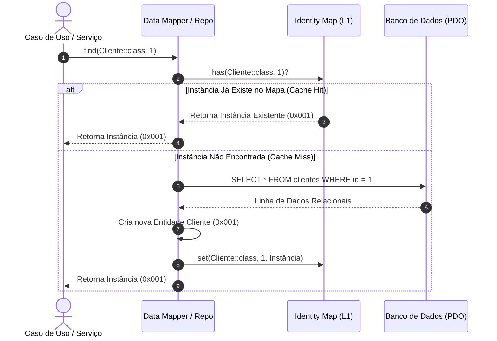

# O Padrão Identity Map (Mapa de Identidade)

> 📚 **Navegação do Guia de Padrões de Persistência**:
> **[Visão Geral (Persistence)](Persistence.md)** | **[Data Mapper](Data-Mapper.md)** | **[Identity Map](Identity-Map.md)** | **[Unit of Work](Unit-of-Work.md)** | **[Virtual Proxy](Virtual-Proxy.md)**

---

## 🏛️ O que é o Identity Map?

O **Identity Map** (Mapa de Identidade) é um padrão de projeto corporativo catalogado por **Martin Fowler** em seu livro *Patterns of Enterprise Application Architecture (PoEAA)*.

Sua definição fundamental é:
> *"Garante que cada objeto seja carregado apenas uma única vez, mantendo cada objeto carregado em um mapa. Consulta o mapa sempre que busca por objetos."*

No ecossistema PHP (como no **Doctrine ORM**), o Identity Map atua como o **Cache de Primeiro Nível (L1 Cache / In-Memory Session Cache)**. Ele vive estritamente durante o ciclo de vida da requisição HTTP (ou durante a sessão de trabalho de um comando CLI).

---

## ⚠️ O Problema: Múltiplas Instâncias e Loops Circulares

Imagine um cenário sem o Identity Map em que temos duas tabelas: `pedidos` e `clientes`. O cliente "João" (ID 1) possui dois pedidos registrados no banco (Pedido 10 e Pedido 20).

Se você buscar os dois pedidos e mapeá-los para objetos separadamente:

```
[Consulta Banco] ──> Cria Pedido #10 ──> Cria Cliente #1 (Instância A: 0x001)
[Consulta Banco] ──> Cria Pedido #20 ──> Cria Cliente #1 (Instância B: 0x002)
```

### Consequências Críticas:
1. **Quebra da Identidade Referencial (`$clienteA !== $clienteB`)**:  
   Embora ambos representem o mesmo registro no banco de dados com ID 1, eles são dois objetos fisicamente distintos na memória RAM do PHP.
2. **Inconsistência de Estado e Alterações Perdidas (*Lost Updates*)**:  
   Se o seu código alterar o e-mail no objeto do Pedido 10 (`$pedido10->getCliente()->alterarEmail(...)`), o objeto do Pedido 20 continuará com o e-mail antigo desatualizado! Ao salvar, uma alteração pode sobreescrever a outra silenciosamente.
3. **Loop Infinito em Grafos Circulares**:  
   Se a entidade `Cliente` contiver uma lista de `Pedidos` e cada `Pedido` contiver a referência de volta para seu `Cliente`, a hidratação sem Identity Map entrará em recursão infinita:
   `Cliente ➡️ Pedido ➡️ Novo Cliente ➡️ Novo Pedido ➡️ Outro Cliente... ➡️ Fatal Error: Maximum function nesting level reached`!

---

## 🛡️ A Solução: O "Porteiro" de Instâncias

O Identity Map funciona como um registro central de instâncias ativas na memória. Antes de executar uma query SQL ou instanciar um novo objeto, o repositório ou mapper pergunta ao mapa: *"Você já tem a entidade `Cliente` com o ID `1`?"*



---

## 💻 Implementação Prática em PHP 8.2+ Puro

Abaixo está uma implementação completa, fortemente tipada e com resolução elegante de referências circulares:

### 1. A Classe do Identity Map

```php
<?php

declare(strict_types=1);

namespace App\Infrastructure\Persistence\IdentityMap;

final class IdentityMap 
{
    /**
     * Matriz de instâncias organizadas por [NomeDaClasse][ID]
     * @var array<string, array<int|string, object>>
     */
    private array $registry = [];

    /**
     * Registra uma entidade associando-a à sua classe e identificador
     */
    public function set(string $className, int|string $id, object $entity): void 
    {
        $this->registry[$className][$id] = $entity;
    }

    /**
     * Recupera a entidade da memória se existir
     */
    public function get(string $className, int|string $id): ?object 
    {
        return $this->registry[$className][$id] ?? null;
    }

    /**
     * Verifica se a entidade já está registrada
     */
    public function has(string $className, int|string $id): bool 
    {
        return isset($this->registry[$className][$id]);
    }

    /**
     * Remove uma entidade do mapa (útil em exclusões)
     */
    public function remove(string $className, int|string $id): void 
    {
        unset($this->registry[$className][$id]);
    }

    /**
     * Esvazia todo o mapa de identidade (CRUCIAL para processos em lote e filas!)
     */
    public function clear(?string $className = null): void 
    {
        if ($className !== null) {
            unset($this->registry[$className]);
            return;
        }

        $this->registry = [];
    }

    /**
     * Retorna a quantidade de instâncias monitoradas
     */
    public function count(): int 
    {
        $total = 0;
        foreach ($this->registry as $entities) {
            $total += count($entities);
        }
        return $total;
    }
}
```

---

### 2. Entidades de Domínio com Associação Bidirecional

```php
<?php

declare(strict_types=1);

namespace App\Domain\Entity;

final class Cliente 
{
    /** @var Pedido[] */
    private array $pedidos = [];

    public function __construct(
        public readonly int $id,
        private string $nome
    ) {}

    public function getNome(): string 
    {
        return $this->nome;
    }

    public function setNome(string $nome): void 
    {
        $this->nome = $nome;
    }

    public function adicionarPedido(Pedido $pedido): void 
    {
        $this->pedidos[] = $pedido;
    }

    /** @return Pedido[] */
    public function getPedidos(): array 
    {
        return $this->pedidos;
    }
}

final class Pedido 
{
    public function __construct(
        public readonly int $id,
        public readonly float $valor,
        private ?Cliente $cliente = null
    ) {}

    public function getCliente(): ?Cliente 
    {
        return $this->cliente;
    }

    public function setCliente(Cliente $cliente): void 
    {
        $this->cliente = $cliente;
    }
}
```

---

### 3. O Data Mapper Integrado ao Identity Map

Veja como o `ClienteMapper` consulta o mapa **antes** de ir ao banco e **armazena a nova instância** logo após criá-la:

```php
<?php

declare(strict_types=1);

namespace App\Infrastructure\Persistence\Mapper;

use App\Domain\Entity\Cliente;
use App\Infrastructure\Persistence\IdentityMap\IdentityMap;
use PDO;

final class ClienteMapper 
{
    public function __construct(
        private PDO $pdo,
        private IdentityMap $identityMap
    ) {}

    public function find(int $id): ?Cliente 
    {
        // 1. PASSO 1: Verificar se a instância já existe na memória RAM
        if ($this->identityMap->has(Cliente::class, $id)) {
            /** @var Cliente */
            return $this->identityMap->get(Cliente::class, $id);
        }

        // 2. PASSO 2: Se ausente, busca fisicamente no banco de dados
        $stmt = $this->pdo->prepare('SELECT id, nome FROM clientes WHERE id = :id');
        $stmt->execute(['id' => $id]);
        $row = $stmt->fetch(PDO::FETCH_ASSOC);

        if (!$row) {
            return null;
        }

        // 3. PASSO 3: Instancia o objeto de domínio puro
        $cliente = new Cliente((int) $row['id'], $row['nome']);

        // 4. PASSO 4: REGISTRA NO IDENTITY MAP IMEDIATAMENTE!
        // Fazemos isso antes de carregar quaisquer relacionamentos para evitar loops circulares!
        $this->identityMap->set(Cliente::class, $cliente->id, $cliente);

        return $cliente;
    }
}
```

---

## 🧪 Demonstração de Prova: Unicidade de Instância

Execute este teste conceitual para comprovar a quebra da duplicação e a consistência de ponteiros de memória:

```php
<?php

$identityMap = new IdentityMap();
$mapper = new ClienteMapper($pdo, $identityMap);

// Primeira busca: Dispara SELECT no banco e guarda no mapa
$joaoPrimeiraVez = $mapper->find(1);

// Segunda busca pelo mesmo ID: Não toca no banco! Retorna do mapa
$joaoSegundaVez = $mapper->find(1);

// 🔍 Prova de Identidade Estrita:
// Não é apenas igualdade de valores (==), é a MESMA INSTÂNCIA NA RAM (===)
var_dump($joaoPrimeiraVez === $joaoSegundaVez); // true!

// Se alterarmos o nome em uma variável:
$joaoPrimeiraVez->setNome('João Carlos da Silva');

// A outra variável reflete imediatamente a mudança:
echo $joaoSegundaVez->getNome(); // "João Carlos da Silva"
```

---

## ⚡ Identity Map vs. Cache de Aplicação (Redis / PSR-16)

Uma confusão muito comum em entrevistas técnicas e exames é achar que o Identity Map substitui um servidor de cache como o Redis:

| Aspecto | 🧠 Identity Map | ⚡ Cache de Aplicação (PSR-16 / Redis) |
| :--- | :--- | :--- |
| **Escopo** | **Por Requisição / Transação**: Morre quando a resposta HTTP é enviada. | **Global / Distribuído**: Compartilhado entre todas as requisições e servidores. |
| **Objetivo** | **Integridade de Identidade**: Garantir que o mesmo registro seja o mesmo objeto em memória (`===`). | **Performance de I/O**: Evitar consultas lentas no banco de dados. |
| **Formato Armazenado** | Objetos PHP vivos na memória RAM do worker (`stdClass`, POPOs). | Strings serializadas, JSON ou binários. |
| **Invalidação** | Automática ao final do ciclo de vida da requisição. | Requer política de expiração (TTL, tags, invalidação explícita). |

---

## 🚨 Pegadinha de Produção: Memory Leaks em Workers de Fila (CLI)

> [!CAUTION]
> **Atenção Máxima em Processos Long-Running (Daemons, Consumers de Mensageria):**  
> Em uma requisição HTTP tradicional do PHP, o script finaliza em centenas de milissegundos e toda a memória RAM é liberada pelo PHP Engine.  
> Porém, em **workers de fila contínuos** (ex: `php artisan queue:work` ou Symfony Messenger), o processo pode ficar vivo por dias. Se o worker processar 50.000 mensagens e carregar centenas de entidades no Identity Map sem limpá-lo, o uso de memória crescerá progressivamente até o processo ser morto pelo sistema operacional com `Fatal error: Allowed memory size exhausted`!  
> **A Solução:** Chamar explicitamente `$identityMap->clear()` (ou `$entityManager->clear()` no Doctrine) ao final do processamento de cada mensagem da fila!

---

## 🔗 Próximos Passos no Guia

* Entenda como o **[Unit of Work](Unit-of-Work.md)** trabalha de mãos dadas com o Identity Map para saber quais objetos mudaram de estado e precisam de UPDATE.
* Retorne para a **[Visão Geral de Padrões de Persistência](Persistence.md)** para ver o diagrama completo do ecossistema.
* Veja como o **[Virtual Proxy](Virtual-Proxy.md)** adia a carga de associações mantendo a integridade no Identity Map.
