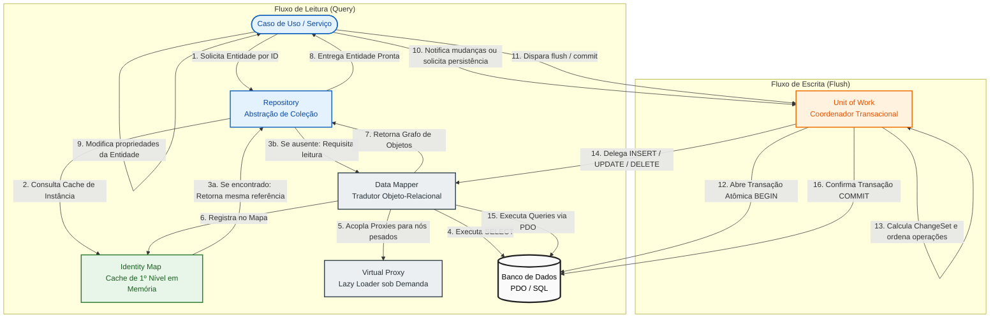

# Persistence Patterns (Padrões de Persistência)

> 📚 **Navegação do Guia de Padrões de Persistência**:
> **[Visão Geral (Persistence)](Persistence.md)** | **[Data Mapper](Data-Mapper.md)** | **[Identity Map](Identity-Map.md)** | **[Unit of Work](Unit-of-Work.md)** | **[Virtual Proxy](Virtual-Proxy.md)**

---

## 🏛️ Introdução aos Padrões de Persistência Corporativos

Na arquitetura de software empresarial, a forma como os objetos de domínio em memória se comunicam com os bancos de dados relacionais é um dos temas mais críticos e cobrados em exames de certificação (como **Zend Certified PHP Engineer**, avaliações de arquitetura de software e discussões da **PHP-FIG**).

Os padrões catalogados por **Martin Fowler** em sua obra seminal *Patterns of Enterprise Application Architecture (PoEAA)* estabeleceram as bases para a construção de ORMs modernos (como o **Doctrine ORM** no ecossistema PHP e o **Hibernate** no Java).

### O Dilema Arquitetural: Active Record vs. Data Mapper

No ecossistema PHP, existem duas grandes filosofias para lidar com persistência:

| Critério | 🥊 Active Record (ex: Eloquent / Laravel) | 🛡️ Data Mapper + Unit of Work (ex: Doctrine / Symfony) |
| :--- | :--- | :--- |
| **Abordagem** | A própria entidade herda de `Model` e sabe como se salvar no banco (`$user->save()`). | A entidade é um objeto puro de domínio (POPO). Ela ignora completamente o banco de dados. |
| **Acoplamento** | Alto: regras de negócio e infraestrutura de banco coexistem na mesma classe. | Baixíssimo: o modelo de domínio é 100% isolado de queries e detalhes de banco. |
| **Complexidade** | Baixa a média: curva de aprendizado rápida, ideal para CRUDs e MVPs. | Média a alta: exige múltiplos padrões cooperando em conjunto. |
| **Testabilidade** | Requer banco de dados ativo ou mocks complexos do Eloquent. | Excepcional: entidades podem ser testadas com testes unitários puros sem mockar banco. |
| **Manutenção em Escala** | Modelos tendem a inflar com o tempo (*God Objects*). | Sustenta regras de domínio ricas e complexas (*Domain-Driven Design - DDD*). |

---

## 🗺️ O Ecossistema Integrado de Persistência

Para que o desacoplamento do **Data Mapper** funcione com alto desempenho e integridade transacional, uma cadeia de padrões trabalha em harmonia durante todo o ciclo de vida da requisição:

---

## 🧭 Guia Passo a Passo do Fluxo de Operações

### 1. O Fluxo de Leitura (Consulta)
1. **A Fronteira do Negócio ([Repository](Data-Mapper.md))**: O serviço da aplicação solicita uma entidade (ex: `find(1)`). O código de negócio nunca escreve SQL diretamente.
2. **A Linha de Defesa da Memória ([Identity Map](Identity-Map.md))**: Antes de qualquer query ser montada, o repositório verifica se o objeto com aquele ID já foi instanciado nesta requisição. Se já existe, devolve a mesma referência em memória imediatamente, poupando I/O.
3. **A Tradução Relacional ([Data Mapper](Data-Mapper.md))**: Se o objeto não estiver na memória, o Data Mapper envia o comando `SELECT` ao banco via PDO e hidrata os atributos da entidade pura.
4. **A Carga Tardia ([Virtual Proxy](Virtual-Proxy.md))**: Relacionamentos pesados (como o histórico de milhares de pedidos de um cliente) não são carregados de imediato. O Data Mapper injeta um *Proxy Virtual* leve. O banco só será consultado se o seu código efetivamente invocar `$cliente->getHistorico()->listar()`.
5. **Registro de Unicidade**: O novo objeto hidratado é salvo no Identity Map para que chamadas subsequentes usem a mesma instância.

### 2. O Fluxo de Escrita (Persistência)
1. **O Sentinela de Estados ([Unit of Work](Unit-of-Work.md))**: Ao longo da execução do caso de uso, as entidades sofrem alterações de estado (novas instâncias são criadas, propriedades são alteradas, registros são marcados para remoção). O Unit of Work mantém a lista de tudo o que está pendente (*New*, *Dirty*, *Removed*).
2. **Atomicidade e Transação**: Ao final do processo, o método `$uow->commit()` (ou `$em->flush()`) é disparado:
   - Abre uma transação atômica no banco de dados (`PDO::beginTransaction()`).
   - Calcula as diferenças (*ChangeSet*) e organiza a ordem de execução para respeitar as chaves estrangeiras (Foreign Keys).
   - Delega ao **Data Mapper** a geração e execução dos comandos `INSERT`, `UPDATE` e `DELETE`.
   - Se todas as instruções forem bem-sucedidas, executa `PDO::commit()`. Se alguma falhar, executa `PDO::rollBack()`, garantindo que o banco nunca fique em estado inconsistente.

---

## 📊 Matriz Comparativa de Responsabilidades

| Padrão | Responsabilidade Central | Onde Atua | O que Acontece se NÃO Usar? |
| :--- | :--- | :--- | :--- |
| **[Data Mapper](Data-Mapper.md)** | Traduz tabelas/colunas SQL em atributos de objetos e vice-versa. | Infraestrutura / Mapeamento | Entidades de domínio ficam poluídas com SQL e acopladas ao banco de dados. |
| **[Identity Map](Identity-Map.md)** | Garante que cada registro do banco tenha exatamente uma única instância em memória. | Sessão / Memória (L1 Cache) | Múltiplas instâncias do mesmo registro, gerando dados inconsistentes e loops infinitos em grafos circulares. |
| **[Unit of Work](Unit-of-Work.md)** | Rastreia modificações em objetos e coordena a gravação atômica em uma única transação. | Transação / Concorrência | Múltiplas gravações avulsas sem transação; se a 3ª falhar, o banco fica parcialmente corrompido. |
| **[Virtual Proxy](Virtual-Proxy.md)** | Adia o carregamento de dados pesados ou associações até o momento exato do acesso (*Lazy Loading*). | Otimização / Carregamento sob demanda | *Eager Loading* excessivo: carregar um cliente consome megabytes de memória trazendo todas as tabelas filhas. |

---

## 📝 Questões de Simulado para Certificação e Concursos de Arquitetura

Pratique com questões no padrão de exames oficiais de arquitetura de software e certificações PHP:

### Questão 1 (Identity Map & Integridade de Instâncias)
**Enunciado:** Em uma aplicação que utiliza o padrão Data Mapper sem um Identity Map, um desenvolvedor busca o Pedido `#10` (pertencente ao Cliente `#5`) e, em seguida, em outro ponto do mesmo fluxo, busca diretamente o Cliente `#5`. O desenvolvedor então altera o endereço do cliente através do objeto obtido no Pedido e tenta salvar ambos. Qual problema técnico ocorre nesse cenário?

- **A)** Uma exceção de chave estrangeira (Foreign Key Constraint Violation) será lançada pelo banco de dados.
- **B)** Haverá duas instâncias separadas do Cliente `#5` na memória (`$clienteA !== $clienteB`), provocando inconsistência de dados em memória e risco de sobreescrita de alterações (*Lost Update*).
- **C)** O PDO bloqueará a conexão com erro de deadlock transacional.
- **D)** O sistema entrará em loop recursivo infinito de chamadas HTTP.

> **Gabarito: B**  
> **Comentário:** Sem o Identity Map, cada consulta ao banco instancia um novo objeto em memória. Com isso, o mesmo registro relacional passa a ter duas identidades distintas em memória. Alterações feitas em uma não são refletidas na outra, quebrando a integridade de dados do domínio. O Identity Map assegura que `$pedido->getCliente() === $clienteRepository->find(5)`.

---

### Questão 2 (Unit of Work vs. Mapeamento Direto)
**Enunciado:** Qual das seguintes afirmações expressa a principal vantagem arquitetural de se utilizar o padrão **Unit of Work** em conjunto com o **Data Mapper**, em vez de executar `$mapper->save($entity)` diretamente a cada alteração de objeto?

- **A)** O Unit of Work elimina a necessidade de índices nas tabelas do banco de dados relacional.
- **B)** O Unit of Work converte automaticamente bancos relacionais em bancos orientados a documentos NoSQL.
- **C)** O Unit of Work consolida todas as alterações pendentes da requisição, calcula as dependências de chaves estrangeiras e executa as queries necessárias em lote dentro de uma única transação atômica (`commit`), prevenindo inconsistências parciais.
- **D)** O Unit of Work permite que as entidades de negócio herdem diretamente da classe de conexão PDO.

> **Gabarito: C**  
> **Comentário:** O propósito central do Unit of Work é gerenciar transações e concorrência. Ele acumula as mudanças em memória (*New, Dirty, Removed*) e, no momento do *flush*, garante que toda a gravação seja atômica (ACID). Se qualquer query falhar, um `rollback` completo é disparado.

---

### Questão 3 (Virtual Proxy & Lazy Loading)
**Enunciado:** O padrão **Virtual Proxy** é empregado por ORMs para implementar o mecanismo de *Lazy Loading*. No entanto, quando utilizado de forma indiscriminada ao iterar sobre uma lista de entidades associadas, qual armadilha clássica de desempenho pode surgir?

- **A)** O problema da consulta N+1 (*N+1 Query Problem*).
- **B)** Estouro de pilha recursiva (*Stack Overflow Exception*).
- **C)** Corrupção dos arquivos de log da PSR-3.
- **D)** Incompatibilidade com as diretrizes de tipagem estrita do PHP 8+.

> **Gabarito: A**  
> **Comentário:** Se você busca 100 clientes e depois itera sobre cada um chamando `$cliente->getEndereco()->getCidade()`, e o endereço estiver como Virtual Proxy, o sistema executará 1 consulta para os clientes + 100 consultas individuais adicionais (uma para cada endereço). Para mitigar isso, utiliza-se *Eager Loading com JOIN* ou carregamento em lote (*Batch Fetching*).

---

## 🔗 Navegue pelos Padrões Detalhados

Aprofunde-se na teoria e nas implementações completas em PHP 8.2+:

1. 📄 **[Data Mapper](Data-Mapper.md)**: Isolando o Domínio do Banco de Dados com POPOs puros.
2. 📄 **[Identity Map](Identity-Map.md)**: Evitando duplicações de memória e quebrando grafos circulares.
3. 📄 **[Unit of Work](Unit-of-Work.md)**: Coordenação de transações atômicas e rastreamento de mudanças.
4. 📄 **[Virtual Proxy](Virtual-Proxy.md)**: Carga tardia sob demanda (Lazy Loading) e novidades do PHP 8.4 Lazy Objects.
