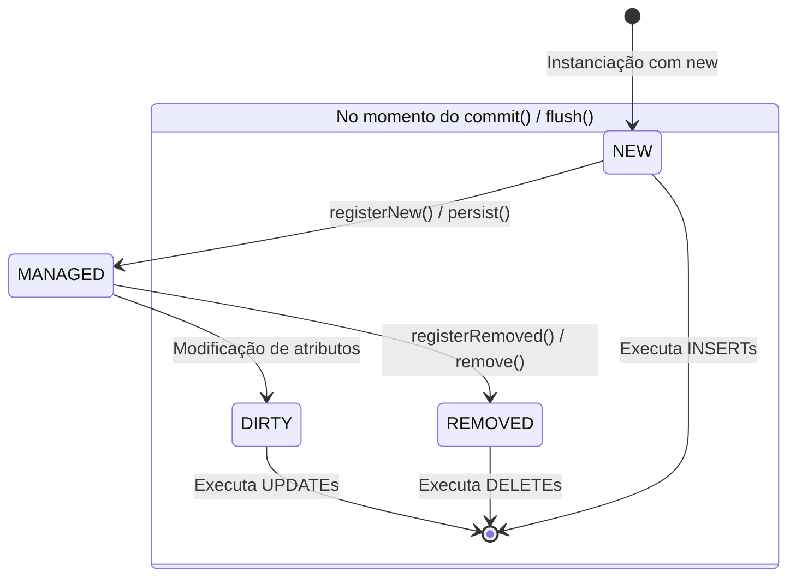

# O Padrão Unit of Work (Unidade de Trabalho)

> 📚 **Navegação do Guia de Padrões de Persistência**:
> **[Visão Geral (Persistence)](Persistence.md)** | **[Data Mapper](Data-Mapper.md)** | **[Identity Map](Identity-Map.md)** | **[Unit of Work](Unit-of-Work.md)** | **[Virtual Proxy](Virtual-Proxy.md)**

---

## 🏛️ O que é o Unit of Work?

O **Unit of Work** (Unidade de Trabalho) é um dos padrões arquiteturais mais importantes catalogados por **Martin Fowler** no livro *Patterns of Enterprise Application Architecture (PoEAA)*.

Sua definição clássica é:
> *"Mantém uma lista de objetos afetados por uma transação de negócios e coordena a escrita das mudanças e a resolução de problemas de concorrência."*

Em termos práticos, imagine o Unit of Work como um **gerente de cartório e transações bancárias**. Em vez de persistir cada alteração no banco de dados imediatamente a cada chamada de método, o Unit of Work acumula todas as intenções de mudança em memória e as descarrega de uma só vez, em uma única transação atômica (tudo ou nada).

---

## ⚠️ O Problema: Operações Fragmentadas e Inconsistência de Dados

Imagine um cenário sem o Unit of Work onde um caso de uso precisa transferir saldo e emitir uma fatura:

```php
// ❌ Sem Unit of Work: Persistência fragmentada e frágil
$cliente->removerSaldo(500);
$clienteMapper->update($cliente); // Operação 1: Sucesso! Gravou no banco.

$fatura = new Fatura($cliente, 500);
$faturaMapper->insert($fatura);    // Operação 2: Falha por queda de rede ou timeout!
```

### O que aconteceu?
* O saldo foi descontado do cliente, mas a fatura nunca foi gerada.
* O banco de dados agora está em um **estado corrompido/inconsistente**.
* Além disso, se você alterar 20 entidades em um loop, fará 20 requisições individuais de rede ao banco de dados, degradando a performance.

---

## 🛡️ A Solução: Ciclo de Vida e Transação Atômica

O Unit of Work monitora o ciclo de vida de cada entidade e as classifica em estados:



### Ordem Crítica de Execução (Integridade Referencial)
O Unit of Work organiza as operações para evitar violações de integridade relacional (*Foreign Keys*):
1. **INSERTs Primeiro**: Garante que os registros pais existam antes que seus filhos tentem apontar para eles.
2. **UPDATEs em Seguida**: Modifica registros existentes, recalculando apenas os campos alterados (*ChangeSet*).
3. **DELETEs por Último**: Exclui primeiro os registros dependentes (filhos) antes de tentar deletar os pais.

---

## 🔬 Estratégias de Rastreamento de Mudanças (Change Tracking)

Existem duas formas principais de um Unit of Work saber que um objeto foi modificado:

### 1. Active / Notifying Tracking (Rastreamento Ativo)
A própria entidade avisa o Unit of Work que foi alterada (geralmente através de um método `registerDirty()` chamado nos setters). É simples de entender, mas acopla a entidade ao Unit of Work.

### 2. Deferred Implicit Tracking (Snapshot / Diffing do Doctrine ORM)
A abordagem mais elegante e pura:
1. Quando uma entidade é carregada do banco pelo Mapper, o Unit of Work guarda uma cópia fria (*snapshot*) de todas as suas propriedades originais no [Identity Map](Identity-Map.md).
2. Durante a execução, o desenvolvedor altera as entidades normalmente (POPOs puros).
3. Ao chamar `commit()`, o Unit of Work compara o objeto atual com o snapshot original (**ChangeSet calculation**). Apenas as propriedades que realmente mudaram entram na cláusula `UPDATE`.

---

## 💻 Implementação Prática em PHP 8.2+ Puro

Abaixo está uma implementação funcional de um Unit of Work orquestrando transações atômicas com PDO:

```php
<?php

declare(strict_types=1);

namespace App\Infrastructure\Persistence\UnitOfWork;

use PDO;
use RuntimeException;
use SplObjectStorage;
use Throwable;

enum EntityState 
{
    case NEW;
    case MANAGED;
    case DIRTY;
    case REMOVED;
}

final class UnitOfWork 
{
    /** @var SplObjectStorage<object, EntityState> */
    private SplObjectStorage $entityStates;

    /** @var array<string, object> Mapeamento de Classe -> Mapper */
    private array $mappers = [];

    public function __construct(private PDO $pdo) 
    {
        $this->entityStates = new SplObjectStorage();
    }

    public function registerMapper(string $className, object $mapper): void 
    {
        $this->mappers[$className] = $mapper;
    }

    /**
     * Registra uma nova entidade para INSERT
     */
    public function registerNew(object $entity): void 
    {
        $this->entityStates->attach($entity, EntityState::NEW);
    }

    /**
     * Registra uma entidade existente que foi modificada para UPDATE
     */
    public function registerDirty(object $entity): void 
    {
        if ($this->entityStates->contains($entity) && $this->entityStates[$entity] === EntityState::NEW) {
            return; // Se ela é nova, o INSERT já vai salvar o estado atualizado
        }
        $this->entityStates->attach($entity, EntityState::DIRTY);
    }

    /**
     * Marca uma entidade para exclusão física (DELETE)
     */
    public function registerRemoved(object $entity): void 
    {
        if ($this->entityStates->contains($entity) && $this->entityStates[$entity] === EntityState::NEW) {
            $this->entityStates->detach($entity); // Se era nova e foi removida antes do flush, basta ignorar
            return;
        }
        $this->entityStates->attach($entity, EntityState::REMOVED);
    }

    /**
     * O "Grande Momento": Executa tudo dentro de uma transação isolada e atômica (ACID)
     */
    public function commit(): void 
    {
        // Separação em filas ordenadas
        $inserts = [];
        $updates = [];
        $deletes = [];

        foreach ($this->entityStates as $entity) {
            $state = $this->entityStates[$entity];
            match ($state) {
                EntityState::NEW     => $inserts[] = $entity,
                EntityState::DIRTY   => $updates[] = $entity,
                EntityState::REMOVED => $deletes[] = $entity,
                default              => null,
            };
        }

        // Se não houver operações pendentes, encerra sem abrir transação
        if (empty($inserts) && empty($updates) && empty($deletes)) {
            return;
        }

        // 🔒 INÍCIO DA TRANSAÇÃO ATÔMICA
        $this->pdo->beginTransaction();

        try {
            // 1. Executa todos os INSERTS
            foreach ($inserts as $entity) {
                $mapper = $this->getMapper(get_class($entity));
                $mapper->insert($entity);
            }

            // 2. Executa todos os UPDATES
            foreach ($updates as $entity) {
                $mapper = $this->getMapper(get_class($entity));
                $mapper->update($entity);
            }

            // 3. Executa todos os DELETES
            foreach ($deletes as $entity) {
                $mapper = $this->getMapper(get_class($entity));
                $mapper->delete($entity->getId());
            }

            // ✅ Tudo executado com sucesso: Consolida definitivamente no banco
            $this->pdo->commit();

            // Limpa as filas de pendências após confirmação
            $this->entityStates = new SplObjectStorage();

        } catch (Throwable $exception) {
            // ❌ Em caso de qualquer erro em qualquer comando, desfaz 100% das alterações!
            if ($this->pdo->inTransaction()) {
                $this->pdo->rollBack();
            }
            throw $exception;
        }
    }

    private function getMapper(string $className): object 
    {
        if (!isset($this->mappers[$className])) {
            throw new RuntimeException("Nenhum Data Mapper registrado para a classe: {$className}");
        }
        return $this->mappers[$className];
    }
}
```

---

## 🚀 O Fluxo de Execução no Caso de Uso

Veja como o caso de uso orquestra o processo de forma limpa, segura e desacoplada:

```php
<?php

// 1. Setup das dependências
$pdo = new PDO('sqlite::memory:');
$pdo->setAttribute(PDO::ATTR_ERRMODE, PDO::ERRMODE_EXCEPTION);

$uow = new UnitOfWork($pdo);
$clienteMapper = new ClienteMapper($pdo);
$uow->registerMapper(Cliente::class, $clienteMapper);

// ---- INÍCIO DO CASO DE USO ----

// 1. Criamos um cliente novo (em memória)
$novoCliente = new Cliente(id: null, nome: 'Mariana Lima', email: 'mariana@email.com');
$uow->registerNew($novoCliente);

// 2. Buscamos um cliente existente e alteramos seu estado
$clienteExistente = $clienteMapper->findById(1);
if ($clienteExistente) {
    $clienteExistente->alterarNome('João Modificado');
    $uow->registerDirty($clienteExistente);
}

// ⚠️ ATENÇÃO: Até este ponto exato, NENHUMA QUERY SQL de gravação foi enviada ao banco!

// 3. Ponto de Persistência Atômica:
// Abre transação, roda os INSERTs, depois os UPDATEs, e dá COMMIT!
$uow->commit();

// ---- FIM DO CASO DE USO ----
```

---

## 🎯 Pergunta Clássica de Certificação: `persist()` vs `flush()`

Se você prestar provas de certificação PHP ou entrevistas sobre **Doctrine ORM**, esta é a pergunta mais frequente:

> **Qual a diferença entre `$entityManager->persist($entity)` e `$entityManager->flush()`?**

| Método | O que ele faz? | Toca no banco de dados? |
| :--- | :--- | :--- |
| **`persist($entity)`** | Informa ao Unit of Work que uma nova entidade deve ser monitorada e agendada para inserção no próximo flush. | ❌ **NÃO**. Nenhuma query SQL é gerada no momento da chamada. É uma operação 100% em memória. |
| **`flush()`** | Aciona o método `commit()` do Unit of Work. Calcula o *ChangeSet*, abre a transação PDO, executa todos os `INSERT`, `UPDATE` e `DELETE` pendentes e finaliza a transação. | ✅ **SIM**. É aqui que todo o I/O de rede e comandos SQL acontecem. |

---

## 🧩 O Papel do EntityManager em Frameworks

Em frameworks como Symfony (ou Doctrine Standalone), você raramente instancia `UnitOfWork` ou `IdentityMap` manualmente. 

O **EntityManager** atua como uma **Fachada (Facade)** que encapsula:
1. O **[Identity Map](Identity-Map.md)** (para garantir instâncias únicas na requisição).
2. O **[Unit of Work](Unit-of-Work.md)** (para gerenciar a transação atômica e change tracking).
3. O **[Data Mapper](Data-Mapper.md)** (para gerar o SQL e mapear colunas).
4. O **[Virtual Proxy](Virtual-Proxy.md)** (para carregar associações sob demanda).

---

## 🔗 Próximos Passos no Guia

* Veja como o **[Virtual Proxy](Virtual-Proxy.md)** implementa o carregamento sob demanda (*Lazy Loading*) sem sobrecarregar a memória do Unit of Work.
* Relembre o papel do **[Data Mapper](Data-Mapper.md)** no isolamento das entidades de domínio.
* Revise a **[Visão Geral de Padrões de Persistência](Persistence.md)** e resolva os simulados de certificação.
