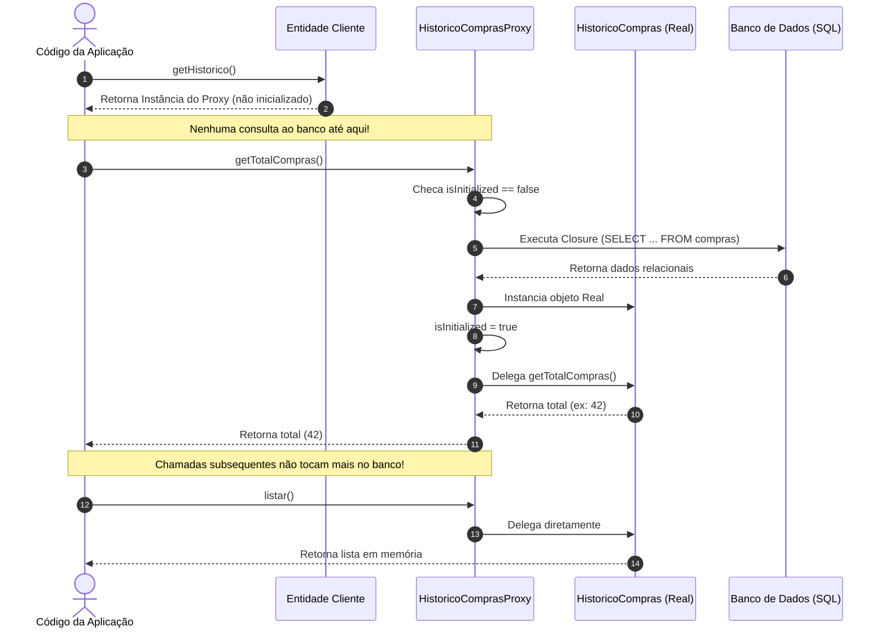

# O Padrão Virtual Proxy (Proxy Virtual)

> 📚 **Navegação do Guia de Padrões de Persistência**:
> **[Visão Geral (Persistence)](Persistence.md)** | **[Data Mapper](Data-Mapper.md)** | **[Identity Map](Identity-Map.md)** | **[Unit of Work](Unit-of-Work.md)** | **[Virtual Proxy](Virtual-Proxy.md)**

---

## 🏛️ O que é o Virtual Proxy?

O **Virtual Proxy** (Proxy Virtual) é um padrão de projeto estrutural (catalogado originalmente pelo **GoF - Gang of Four** e adaptado para persistência corporativa por **Martin Fowler** no livro *PoEAA*).

Sua definição clássica é:
> *"Um objeto que não contém todos os dados do objeto real, mas sabe como obtê-los quando solicitado."*

No ecossistema de persistência de dados e ORMs (como o **Doctrine**), o Virtual Proxy é o mecanismo fundamental que viabiliza o **Lazy Loading** (Carga Tardia ou Carregamento sob Demanda).

---

## ⚠️ O Problema: Eager Loading Excessivo

Imagine um sistema de e-commerce onde uma entidade `Cliente` possui um relacionamento com um `HistoricoCompras`, composto por milhares de registros detalhados:

```
[Cliente: ID 1] ──> [Histórico de Compras: 15.000 pedidos, notas fiscais, itens...]
```

Se o seu [Data Mapper](Data-Mapper.md) adotar a estratégia de **Eager Loading** (Carga Imediata), toda vez que você fizer:
```php
$cliente = $clienteMapper->find(1);
echo $cliente->getNome(); // Apenas queríamos o nome!
```
O sistema disparará consultas pesadas, trazendo milhares de registros e consumindo dezenas de megabytes de memória RAM desnecessariamente.

---

## 🛡️ A Solução: O Virtual Proxy

Em vez de carregar a entidade real com todos os seus dados imediatamente:
1. O Mapper instancia um **objeto Proxy** leve que herda da classe de domínio ou implementa a mesma interface.
2. O Proxy recebe apenas uma instrução (uma *Closure* ou *Callback*) sobre como buscar os dados reais no banco de dados.
3. No momento em que qualquer método de negócio do objeto for invocado pela primeira vez, o Proxy intercepta a chamada, executa a consulta no banco, materializa o objeto real e delega a execução.



---

## 💻 Implementação Prática em PHP 8.2+ Puro

Abaixo está uma implementação limpa e fortemente tipada em PHP moderno utilizando o padrão de interceptação por herança e inicialização por *Closure*:

### 1. A Classe de Domínio Real (Pesada)

```php
<?php

declare(strict_types=1);

namespace App\Domain\Entity;

class HistoricoCompras 
{
    /**
     * @param array<int, array{id: int, item: string, valor: float}> $registros
     */
    public function __construct(private array $registros = []) {}

    public function getTotalCompras(): int 
    {
        return count($this->registros);
    }

    /**
     * @return array<int, array{id: int, item: string, valor: float}>
     */
    public function listar(): array 
    {
        return $this->registros;
    }
}
```

---

### 2. O Virtual Proxy (Lazy Loader)

O Proxy estende a classe original para manter a compatibilidade total de tipo (*Substituição de Liskov - LSP*):

```php
<?php

declare(strict_types=1);

namespace App\Infrastructure\Persistence\Proxy;

use App\Domain\Entity\HistoricoCompras;
use Closure;

final class HistoricoComprasProxy extends HistoricoCompras 
{
    private ?HistoricoCompras $realSubject = null;
    private bool $isInitialized = false;

    /**
     * @param Closure(): HistoricoCompras $initializer Função anônima que busca no banco
     */
    public function __construct(private Closure $initializer) 
    {
        // Não chamamos parent::__construct() com dados para manter a instância vazia e leve
    }

    /**
     * Dispara a busca física no banco de dados APENAS UMA VEZ
     */
    private function initialize(): void 
    {
        if (!$this->isInitialized) {
            // Executa a função que carrega os dados reais
            $this->realSubject = ($this->initializer)();
            $this->isInitialized = true;
        }
    }

    // --- INTERCEPTAÇÃO DOS MÉTODOS PÚBLICOS ---

    public function getTotalCompras(): int 
    {
        $this->initialize();
        return $this->realSubject->getTotalCompras();
    }

    public function listar(): array 
    {
        $this->initialize();
        return $this->realSubject->listar();
    }

    public function isInitialized(): bool 
    {
        return $this->isInitialized;
    }
}
```

---

### 3. A Entidade Principal e a Injeção pelo Data Mapper

```php
<?php

declare(strict_types=1);

namespace App\Domain\Entity;

final class Cliente 
{
    public function __construct(
        public readonly int $id,
        private string $nome,
        // O tipo exige HistoricoCompras, e HistoricoComprasProxy é aceito perfeitamente!
        private HistoricoCompras $historico
    ) {}

    public function getNome(): string 
    {
        return $this->nome;
    }

    public function getHistorico(): HistoricoCompras 
    {
        return $this->historico;
    }
}
```

No [Data Mapper](Data-Mapper.md), o Proxy é montado com a consulta sob demanda:

```php
<?php

declare(strict_types=1);

namespace App\Infrastructure\Persistence\Mapper;

use App\Domain\Entity\Cliente;
use App\Domain\Entity\HistoricoCompras;
use App\Infrastructure\Persistence\Proxy\HistoricoComprasProxy;
use PDO;

final class ClienteMapper 
{
    public function __construct(private PDO $pdo) {}

    public function find(int $id): ?Cliente 
    {
        // 1. Busca dados básicos do cliente
        $stmt = $this->pdo->prepare('SELECT id, nome FROM clientes WHERE id = :id');
        $stmt->execute(['id' => $id]);
        $row = $stmt->fetch(PDO::FETCH_ASSOC);

        if (!$row) {
            return null;
        }

        // 2. Cria o PROXY para o relacionamento em vez de fazer o SELECT de compras agora!
        $historicoProxy = new HistoricoComprasProxy(function () use ($id): HistoricoCompras {
            // Esta closure SÓ EXECUTA se alguém invocar métodos de $historico
            $stmtCompras = $this->pdo->prepare('SELECT id, item, valor FROM compras WHERE cliente_id = :id');
            $stmtCompras->execute(['id' => $id]);
            $compras = $stmtCompras->fetchAll(PDO::FETCH_ASSOC);

            return new HistoricoCompras($compras);
        });

        // 3. Retorna a entidade com o proxy acoplado de forma transparente
        return new Cliente((int) $row['id'], $row['nome'], $historicoProxy);
    }
}
```

---

## ⚡ O Grande Destaque Moderno: PHP 8.4 Native Lazy Objects!

> [!TIP]
> **Revolução no PHP 8.4:**  
> Historicamente, frameworks como o Doctrine precisavam gerar arquivos de classes Proxy em disco em diretórios como `var/cache/proxies/` utilizando bibliotecas pesadas de geração de código (como `Ocramius/ProxyManager`).  
> A partir do **PHP 8.4**, o PHP introduziu suporte nativo a Lazy Objects na sua API de reflexão (`ReflectionClass`), dispensando qualquer biblioteca externa!

Existem duas variantes nativas no PHP 8.4:
1. **Ghost Objects (`newLazyGhost`)**: A própria instância começa não inicializada e se hidrata internamente no primeiro acesso à propriedade.
2. **Virtual Proxies (`newLazyProxy`)**: O objeto atua como um invólucro transparente delegando para uma instância interna.

Exemplo conceitual nativo em **PHP 8.4**:

```php
// PHP 8.4+: Criação nativa sem precisar criar a classe HistoricoComprasProxy!
$reflection = new ReflectionClass(HistoricoCompras::class);

$lazyHistorico = $reflection->newLazyGhost(function (HistoricoCompras $ghost) use ($pdo, $clienteId) {
    // Busca dados no banco e hidrata o próprio objeto
    $compras = $pdo->query("SELECT ... WHERE cliente_id = {$clienteId}")->fetchAll();
    
    // Inicializa o estado interno do objeto
    $ghost->__construct($compras);
});
```

---

## ⚠️ A Armadilha de Desempenho: O Problema da Consulta N+1

Embora o Virtual Proxy economize muita memória, ele introduz uma das armadilhas mais comuns de bancos de dados se utilizado sem cautela: **o problema N+1**.

### Cenário de Risco:
```php
// 1 consulta para trazer 100 clientes
$clientes = $clienteMapper->listarTodos(); 

foreach ($clientes as $cliente) {
    // 💥 CUIDADO: Dispara 100 consultas individuais adicionais no banco de dados!
    echo $cliente->getHistorico()->getTotalCompras();
}
```
**Resultado:** 1 consulta para listar clientes + 100 consultas individuais para os proxies = **101 consultas (N+1)**.

### Como Solucionar?
* **Eager Loading com JOIN**: Quando souber de antemão que precisará dos dados da associação, instrua o repositório a fazer um `LEFT JOIN` na consulta inicial (`findWithHistorico()`).
* **Batch Fetching**: Agrupar os IDs dos clientes e buscar os históricos com uma cláusula `WHERE cliente_id IN (...)`.

---

## 🧩 Resumo Arquitetural Integrado

Com os 4 padrões implementados, veja como as peças se encaixam harmoniosamente:

1. **[Data Mapper](Data-Mapper.md)**: Constrói os objetos de domínio e injeta o **Virtual Proxy** para nós pesados.
2. **[Virtual Proxy](Virtual-Proxy.md)**: Impede a carga desnecessária de relacionamentos e adia as consultas ao banco.
3. **[Identity Map](Identity-Map.md)**: Garante que, quando um Proxy materializar um objeto que já existia na memória, a mesma referência seja reutilizada, prevenindo inconsistências e loops.
4. **[Unit of Work](Unit-of-Work.md)**: Monitora tudo o que foi alterado nas entidades (reais ou materializadas por proxies) e efetua a persistência em uma transação atômica única no final.

---

## 🔗 Próximos Passos no Guia

* Revise o ciclo completo na **[Visão Geral de Padrões de Persistência](Persistence.md)** e resolva os exercícios de simulado.
* Entenda como o **[Unit of Work](Unit-of-Work.md)** coordena a gravação atômica dessas alterações.
* Relembre o papel do **[Data Mapper](Data-Mapper.md)** e do **[Identity Map](Identity-Map.md)**.
