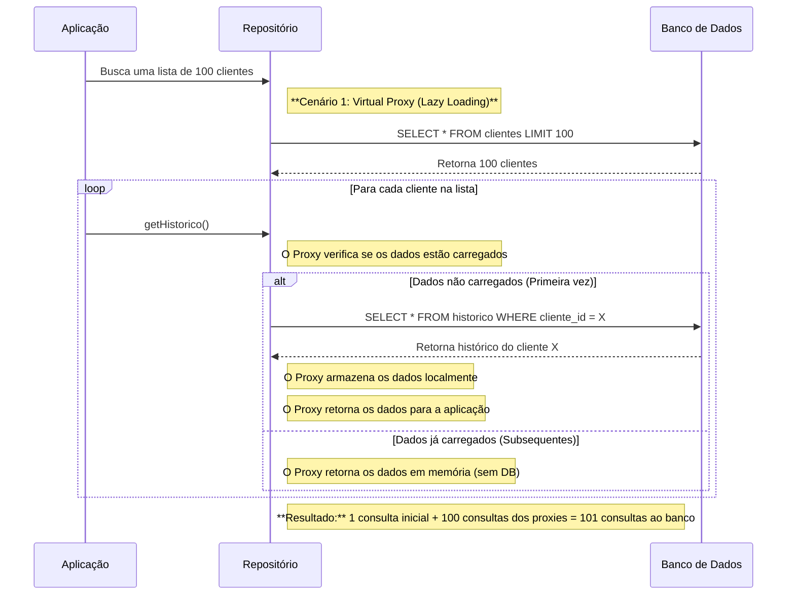
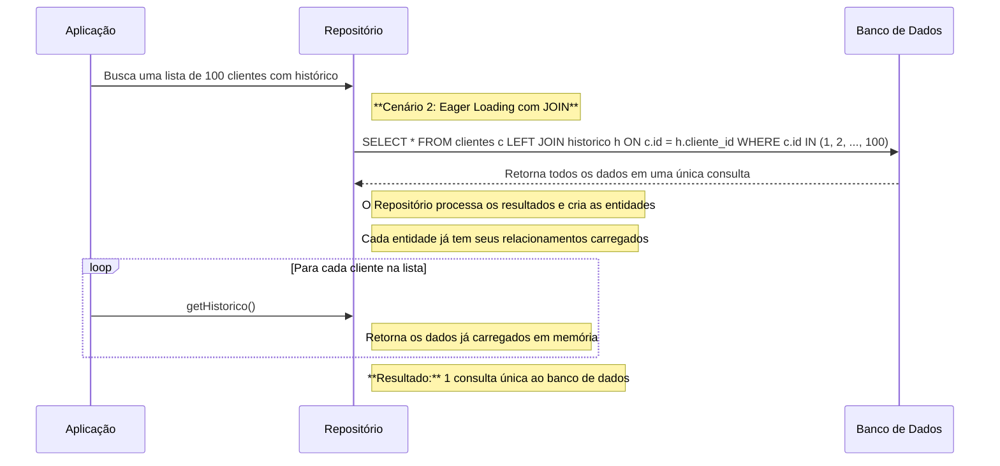

# 🔮 Virtual Proxy e o Problema N+1

> As fontes esclarecem uma importante ressalva arquitetural: o **Virtual Proxy** (mecanismo que viabiliza o *Lazy Loading*) **não resolve** por si só o problema N+1. Pelo contrário, quando utilizado de forma indiscriminada ao iterar sobre uma lista de entidades, ele é a causa direta da armadilha de desempenho conhecida como **Problema N+1**.

---

### 1. O Papel do Virtual Proxy (Evitando o *Eager Loading*)
O objetivo primário do Virtual Proxy é evitar o **Eager Loading** (carregamento imediato/ansioso). Em vez de fazer consultas SQL pesadas para trazer grafos inteiros de dados relacionados (como milhares de compras de um cliente), o Data Mapper acopla um proxy leve. A consulta ao banco só ocorre no momento exato em que algum método da entidade associada for invocado.

Isso economiza memória RAM e I/O de rede quando você só precisa consultar dados da entidade principal.

---

### 2. Como o Virtual Proxy Gera o Problema N+1
A armadilha surge quando o Virtual Proxy é acionado dentro de laços de repetição (loops):

1. O repositório executa **1 consulta** inicial para listar \\(N\\) entidades (por exemplo, 100 clientes).
2. O código de aplicação itera sobre os clientes e chama um método da associação proxy (ex: `$cliente->getHistorico()->getTotalCompras()`).
3. Como cada proxy é inicializado individualmente sob demanda, ele dispara **\\(N\\) consultas adicionais** ao banco de dados.

**Resultado:** \\(1 \text{ (consulta inicial)} + N \text{ (consultas dos proxies)} = N+1 \text{ consultas}\\) (ou seja, 101 chamadas ao banco).

---

### 3. Como Solucionar o N+1 em Conjunto com Proxies
Para evitar o impacto do N+1 sem abdicar da arquitetura de persistência, as fontes apontam duas estratégias principais:

* **Eager Loading com JOIN**: Quando o caso de uso sabe de antemão que precisará percorrer os relacionamentos de uma lista, orienta-se o repositório a realizar um `LEFT JOIN` na consulta inicial (ex: `findWithHistorico()`), trazendo os dados relacionados de uma só vez.
* **Batch Fetching (Carregamento em Lote)**: O ORM ou repositório agrupa os IDs das entidades da lista e carrega os dados dos proxies de forma conjunta usando a cláusula SQL `WHERE cliente_id IN (...)`.

---

💡 Diagramas exemplos comparando o comportamento de um loop com Virtual Proxy (N+1) contra a solução usando **Eager Loading com JOIN** no Data Mapper:

### Virtual Proxy (N+1)

### Solução: Eager Loading com JOIN
